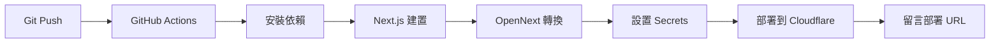

# 🚀 Cloudflare Workers 部署指南

本文檔說明如何將報價系統部署到 Cloudflare Workers，並設置自動化 CI/CD 流程。

---

## 📋 目錄

1. [部署可行性評估](#部署可行性評估)
2. [前置準備](#前置準備)
3. [本地部署測試](#本地部署測試)
4. [設置 GitHub Secrets](#設置-github-secrets)
5. [自動化 CI/CD 部署](#自動化-cicd-部署)
6. [手動部署](#手動部署)
7. [疑難排解](#疑難排解)

---

## ✅ 部署可行性評估

### **結論：可以完全部署到 Cloudflare Workers**

您的專案已經配置好以下支援：

| 功能 | 狀態 | 說明 |
|------|------|------|
| **Next.js 15.5.5** | ✅ 支援 | 使用 OpenNext 適配器 |
| **App Router** | ✅ 支援 | 完全兼容 |
| **PostgreSQL** | ✅ 支援 | 使用 `@neondatabase/serverless` (WebSocket 連接) |
| **Supabase Auth** | ✅ 支援 | 使用 `@supabase/ssr` |
| **環境變數** | ✅ 配置完成 | wrangler.jsonc 已設置 |
| **Cron 任務** | ✅ 支援 | 匯率同步每日執行 |
| **GitHub Actions** | ✅ 已設置 | 自動部署 workflow |

### 已驗證的兼容性

- ✅ **資料庫連接**：自動切換 Node.js `pg` 和 Cloudflare `@neondatabase/serverless`
- ✅ **SSR Cookie**：Supabase 認證完全兼容
- ✅ **API Routes**：57 個 API 路由可正常運行
- ✅ **多語言**：next-intl 支援中英文切換
- ✅ **PDF 生成**：@react-pdf/renderer 兼容 Workers
- ✅ **Email 發送**：Nodemailer 和 Resend 皆可用

---

## 🔧 前置準備

### 1. 安裝 Wrangler CLI

```bash
npm install -g wrangler
# 或使用 pnpm
pnpm add -g wrangler
```

### 2. 登入 Cloudflare

```bash
wrangler login
```

這會開啟瀏覽器進行授權。

### 3. 確認 Cloudflare Account ID

```bash
wrangler whoami
```

記下您的 `Account ID`，需要設置到 GitHub Secrets。

### 4. 準備環境變數

參考 `.env.production.example`，準備以下關鍵環境變數：

```env
# Supabase (認證)
NEXT_PUBLIC_SUPABASE_URL
NEXT_PUBLIC_SUPABASE_ANON_KEY
SUPABASE_SERVICE_ROLE_KEY
SUPABASE_POOLER_URL              # ⚠️ 重要：Cloudflare Workers 必須使用 Pooler URL

# 業務資料庫 (Zeabur)
ZEABUR_POSTGRES_URL

# API Keys
EXCHANGE_RATE_API_KEY
CSRF_SECRET
CRON_SECRET
ADMIN_API_KEY

# Email (擇一)
GMAIL_USER
GMAIL_APP_PASSWORD
# 或
RESEND_API_KEY

# 公司設定
COMPANY_NAME
```

> **⚠️ 關鍵注意事項**：Cloudflare Workers 必須使用 **Supabase Pooler URL**（使用 WebSocket 連接），而非直連 URL。

---

## 🧪 本地部署測試

### 1. 安裝依賴

```bash
pnpm install
```

### 2. 建置專案

```bash
# Next.js 建置
pnpm run build

# OpenNext 轉換為 Cloudflare Workers 格式
pnpm exec opennextjs-cloudflare build
```

### 3. 本地預覽

```bash
pnpm run preview:cf
```

這會啟動本地 Cloudflare Workers 環境，訪問 `http://localhost:8787`。

### 4. 設置本地 Secrets

在本地測試前，需要設置環境變數：

```bash
# 方法 1：使用 .dev.vars 檔案（開發用）
cat > .dev.vars << 'EOF'
NEXT_PUBLIC_SUPABASE_URL=your-value
NEXT_PUBLIC_SUPABASE_ANON_KEY=your-value
SUPABASE_SERVICE_ROLE_KEY=your-value
SUPABASE_POOLER_URL=your-pooler-url
ZEABUR_POSTGRES_URL=your-database-url
EXCHANGE_RATE_API_KEY=your-api-key
CSRF_SECRET=your-csrf-secret
CRON_SECRET=your-cron-secret
ADMIN_API_KEY=your-admin-key
EOF

# 方法 2：直接設置 secrets（生產用）
echo "your-value" | wrangler secret put NEXT_PUBLIC_SUPABASE_URL
```

---

## 🔐 設置 GitHub Secrets

在 GitHub Repository 中設置以下 Secrets：

### 必要的 Secrets

前往 **Settings** → **Secrets and variables** → **Actions** → **New repository secret**

| Secret 名稱 | 說明 | 來源 |
|-------------|------|------|
| `CLOUDFLARE_API_TOKEN` | Cloudflare API Token | Cloudflare Dashboard → API Tokens → Create Token → Edit Cloudflare Workers |
| `NEXT_PUBLIC_SUPABASE_URL` | Supabase 專案 URL | Supabase Dashboard → Project Settings → API |
| `NEXT_PUBLIC_SUPABASE_ANON_KEY` | Supabase 匿名金鑰 | Supabase Dashboard → Project Settings → API |
| `SUPABASE_SERVICE_ROLE_KEY` | Supabase 服務角色金鑰 | Supabase Dashboard → Project Settings → API |
| `SUPABASE_POOLER_URL` | Supabase 連接池 URL (WebSocket) | Supabase Dashboard → Database → Connection Pooling |
| `ZEABUR_POSTGRES_URL` | Zeabur PostgreSQL 連接字串 | Zeabur Dashboard → Service → Instructions |
| `EXCHANGE_RATE_API_KEY` | 匯率 API 金鑰 | https://app.exchangerate-api.com/ |
| `CSRF_SECRET` | CSRF 保護金鑰 (32 字元) | `openssl rand -base64 32` |
| `CRON_SECRET` | Cron 任務驗證金鑰 | `openssl rand -base64 32` |
| `ADMIN_API_KEY` | 管理 API 金鑰 | `openssl rand -base64 32` |

### 可選的 Secrets

| Secret 名稱 | 說明 |
|-------------|------|
| `GMAIL_USER` | Gmail 帳號 (用於發送郵件) |
| `GMAIL_APP_PASSWORD` | Gmail 應用程式密碼 |
| `RESEND_API_KEY` | Resend API 金鑰 (生產環境推薦) |
| `ERROR_WEBHOOK_URL` | 錯誤通知 Webhook (Slack/Discord) |
| `SUCCESS_WEBHOOK_URL` | 成功通知 Webhook |
| `COMPANY_NAME` | 公司名稱 (預設：振禾有限公司) |

### 生成 Cloudflare API Token

1. 前往 [Cloudflare Dashboard](https://dash.cloudflare.com/)
2. 點擊右上角 **My Profile** → **API Tokens**
3. 點擊 **Create Token**
4. 選擇 **Edit Cloudflare Workers** 模板
5. 設置權限：
   - **Account** → **Workers Scripts** → **Edit**
   - **Account** → **Workers KV Storage** → **Edit** (如果使用 KV)
6. 點擊 **Continue to summary** → **Create Token**
7. 複製 Token 並設置到 GitHub Secrets

---

## 🤖 自動化 CI/CD 部署

GitHub Actions 已配置完成，會在以下情況自動部署：

### 觸發條件

- ✅ **Push 到任何分支**：自動部署到對應的 Worker 環境
- ✅ **Pull Request**：自動部署預覽環境並在 PR 中留言

### 部署流程



### 分支命名規則

- **main** 分支 → `quotation-system.acejou27.workers.dev`
- **其他分支** → `quotation-system-{branch-name}.acejou27.workers.dev`

例如：
- `feature/new-api` → `quotation-system-feature-new-api.acejou27.workers.dev`
- `dev` → `quotation-system-dev.acejou27.workers.dev`

### 查看部署日誌

1. 前往 GitHub Repository
2. 點擊 **Actions** 標籤
3. 選擇最新的 workflow run
4. 查看 **Deploy to Cloudflare Workers** 步驟

---

## 🛠️ 手動部署

如果需要手動部署（例如測試或緊急修復），請按以下步驟：

### 1. 建置專案

```bash
pnpm run build
pnpm exec opennextjs-cloudflare build
```

### 2. 設置 Secrets（首次部署必須）

```bash
# 使用腳本批量設置（推薦）
cat > secrets.txt << 'EOF'
NEXT_PUBLIC_SUPABASE_URL
your-supabase-url
NEXT_PUBLIC_SUPABASE_ANON_KEY
your-anon-key
SUPABASE_SERVICE_ROLE_KEY
your-service-role-key
SUPABASE_POOLER_URL
your-pooler-url
ZEABUR_POSTGRES_URL
your-postgres-url
EXCHANGE_RATE_API_KEY
your-exchange-api-key
CSRF_SECRET
your-csrf-secret
CRON_SECRET
your-cron-secret
ADMIN_API_KEY
your-admin-key
EOF

wrangler secret bulk secrets.txt

# 或手動逐一設置
echo "your-value" | wrangler secret put NEXT_PUBLIC_SUPABASE_URL
echo "your-value" | wrangler secret put NEXT_PUBLIC_SUPABASE_ANON_KEY
# ... 依此類推
```

### 3. 部署到 Cloudflare

```bash
# 部署到預設 worker (quotation-system)
pnpm run deploy:cf

# 或指定 worker 名稱
pnpm exec wrangler deploy --name quotation-system-staging
```

### 4. 驗證部署

```bash
# 查看 worker 狀態
wrangler tail quotation-system

# 訪問部署的 URL
curl https://quotation-system.acejou27.workers.dev/api/health
```

---

## 🔍 疑難排解

### 問題 1：資料庫連接失敗

**錯誤訊息**：
```
Error: SUPABASE_POOLER_URL environment variable is required for Cloudflare Workers
```

**解決方案**：
1. 確認已設置 `SUPABASE_POOLER_URL` secret
2. 使用 Supabase **Pooler URL**（不是直連 URL）
3. 前往 Supabase Dashboard → Database → Connection Pooling
4. 複製 **Connection string** (使用 Transaction mode)

### 問題 2：Secrets 未生效

**症狀**：部署成功但應用無法讀取環境變數

**解決方案**：
```bash
# 1. 確認 secrets 已設置
wrangler secret list

# 2. 重新設置特定 secret
echo "new-value" | wrangler secret put SECRET_NAME

# 3. 刪除並重新部署
wrangler delete quotation-system
pnpm run deploy:cf
```

### 問題 3：GitHub Actions 部署失敗

**常見原因**：
- ❌ `CLOUDFLARE_API_TOKEN` 權限不足
- ❌ 缺少必要的 GitHub Secrets
- ❌ Cloudflare Account ID 錯誤

**檢查清單**：
```bash
# 1. 確認 API Token 權限
wrangler whoami

# 2. 檢查 GitHub Secrets（在 GitHub UI）
Settings → Secrets and variables → Actions

# 3. 確認 wrangler.jsonc 中的 account_id
cat wrangler.jsonc | grep account
```

### 問題 4：建置失敗

**錯誤訊息**：
```
Error: Cannot find module '@opennextjs/cloudflare'
```

**解決方案**：
```bash
# 1. 清除快取並重新安裝
rm -rf node_modules pnpm-lock.yaml
pnpm install

# 2. 確認依賴版本
pnpm list @opennextjs/cloudflare

# 3. 重新建置
pnpm run build
pnpm exec opennextjs-cloudflare build
```

### 問題 5：Cron 任務未執行

**症狀**：匯率未自動更新

**解決方案**：
1. 確認 `wrangler.jsonc` 中有 `triggers.crons` 配置
2. 驗證 `CRON_SECRET` 已設置
3. 手動觸發測試：
```bash
curl -X POST https://quotation-system.acejou27.workers.dev/api/cron/exchange-rates \
  -H "Authorization: Bearer YOUR_CRON_SECRET"
```

### 問題 6：Worker 超過大小限制

**錯誤訊息**：
```
Error: Script too large (over 1MB compressed)
```

**解決方案**：
```bash
# 1. 分析建置大小
pnpm exec wrangler deploy --dry-run --outdir=dist

# 2. 優化 next.config.ts
# 加入：
{
  experimental: {
    optimizePackageImports: ['lucide-react', '@headlessui/react']
  }
}

# 3. 檢查不必要的依賴
pnpm exec depcheck
```

---

## 📊 部署檢查清單

部署前請確認以下項目：

### 環境準備
- [ ] 安裝 Wrangler CLI
- [ ] 登入 Cloudflare 帳號
- [ ] 取得 Cloudflare API Token
- [ ] 取得 Supabase Pooler URL
- [ ] 準備所有必要環境變數

### GitHub 設置
- [ ] 設置 `CLOUDFLARE_API_TOKEN`
- [ ] 設置 Supabase 相關 secrets (4 個)
- [ ] 設置 Database URL
- [ ] 設置 API Keys (4 個)
- [ ] 設置 Email secrets (可選)
- [ ] 設置 Webhook URLs (可選)

### 本地測試
- [ ] `pnpm install` 成功
- [ ] `pnpm run build` 成功
- [ ] `pnpm run preview:cf` 可以訪問
- [ ] 登入功能正常
- [ ] 資料庫連接正常
- [ ] API 路由可用

### 部署驗證
- [ ] GitHub Actions workflow 執行成功
- [ ] 訪問部署 URL 正常
- [ ] 登入/登出功能正常
- [ ] 資料庫讀寫正常
- [ ] Cron 任務設置正確
- [ ] Email 發送測試（如果使用）

---

## 🎯 後續優化建議

### 1. 啟用 Cloudflare Pages
- 更好的 CDN 性能
- 免費 SSL 證書
- 自動預覽部署

### 2. 設置 Cloudflare D1（可選）
- 如果需要邊緣資料庫
- 降低 Supabase 請求量

### 3. 監控和日誌
```bash
# 即時查看日誌
wrangler tail quotation-system

# 設置 Sentry 錯誤追蹤
pnpm add @sentry/nextjs
```

### 4. 效能優化
- 啟用 Cloudflare Cache API
- 使用 Cloudflare Images（圖片最佳化）
- 配置 `open-next.config.ts` 快取策略

---

## 📚 相關資源

- [Cloudflare Workers 文檔](https://developers.cloudflare.com/workers/)
- [OpenNext Cloudflare 指南](https://opennext.js.org/cloudflare)
- [Wrangler CLI 文檔](https://developers.cloudflare.com/workers/wrangler/)
- [Supabase Pooler 文檔](https://supabase.com/docs/guides/database/connecting-to-postgres#connection-pooler)
- [Next.js 15 部署指南](https://nextjs.org/docs/app/building-your-application/deploying)

---

## 💡 支援

如有問題，請：
1. 查看本文檔的疑難排解章節
2. 檢查 GitHub Actions 日誌
3. 使用 `wrangler tail` 查看即時日誌
4. 聯絡團隊技術負責人

---

**最後更新**：2025-11-10
**維護者**：Claude Code
**版本**：1.0.0
